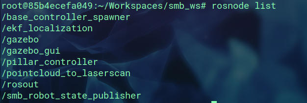
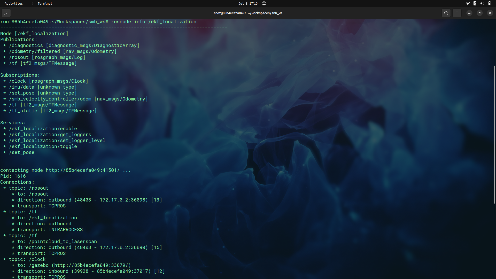
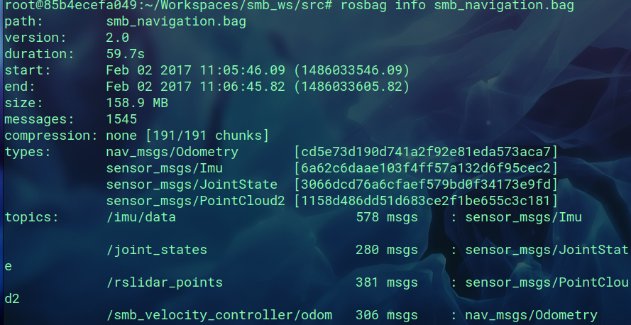
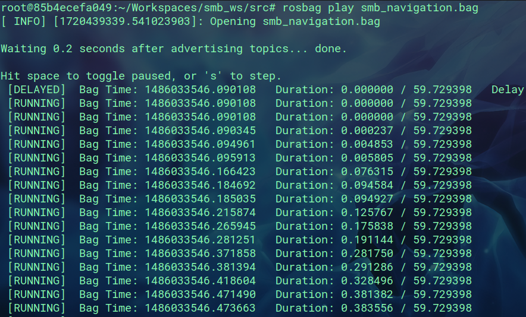

# ROS Assignment 4

To complete this assignment I first launched the previous launch file 
```
roslaunch smb_highlevel_controller smb_highlevel_controller.launch
```
The ran rosnode list <br>
 <br>
Found the /ekf_localization node and then checked it's info<br>

Plotted it with rqt_multiplot and as it can be seen that this node subscribes to /imu/data and /smb_velocity_controller/odom topics and publishes /odometry/filtered topic the data can be be configured from /odometry/filtered topic.<br>

Now the smb_navigation.bag part, inspected it's content using
```
rosbag info smb_navigation.bag
```

<br>
played the bag using <br>
```
rosbag play smb_navigation.bag
```
<br>

<br>
And finally it can be analyzed in rviz.<br>