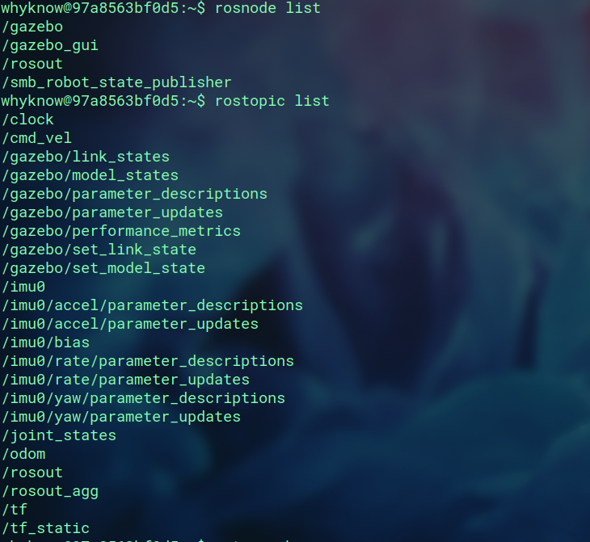
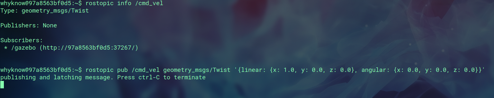
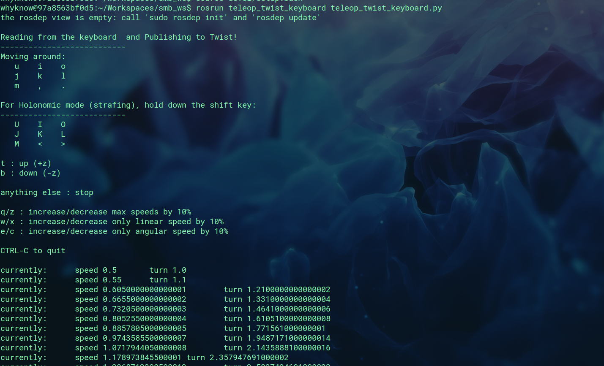
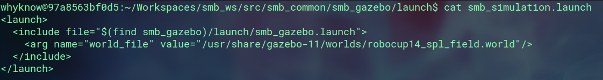

# ROS Assignment 1

### 1.) Setting up the SMB simulation

Installed the zipped folder from the course website and unzipped it in the ~/git folder.<br>
Created the directory ~/Workspaces/smb_ws/src.
Then used the command given below to create a symlink.

```bash
ln -s ~/git/smb_common .
```

then I build the enviornment using

```bash
catkin build smb_gazebo
```

because smb_common was present in smb_gazebo. <br>
To launch the simulation I first source the setup.bash file and then launched the simulation using

```bash
roslaunch smb_gazebo smb_gazebo.launch
```

### 2.) Inspecting the nodes

I inspected the nodes using the given commands and got


### 3.) Commanding velocity
The node /cmd_vel would be used<br>
And to send velocity
```bash
rostopic pub /cmd_vel geometry_msgs/Twist '{linear: {x: 1.0, y: 1.0, z: 0.3}, angular: {x: 0.0, y: 0.0, z: 0.0}}'
```


### 4.) teleop_twist_keyboard
I used git clone to clone the repo in the ~/git folder and then again ran catkin build in the smb_ws directory to use  teleop_twist_keyboard to control my bot using keyboard.



### 5.) Launch file
I followed the instructions and the launch file is

